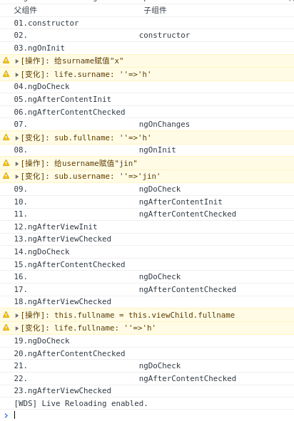

# 生命周期范例

详细代码见 

## 关键代码

### 子组件

sub.component.html

```html
<div>
    <label for="username">名</label>
    <input id="username" type="text" [(ngModel)]="username" (input)="onUsernameInput($event)">
    <!-- 使用ngModel必须在当前模块的module.ts中的import数组中加入FormsModule-->
    <div>
        <span>surname:</span>
        <span>{{surname}}</span>
    </div>
    <div>
        <span>username:</span>
        <span>{{username}}</span>
    </div>
    <div>
        <span>fullname:</span>
        <span>{{fullname}}</span>
    </div>
</div>
```

sub.component.ts

```ts
import { Component, Input, Output, EventEmitter, OnInit, SimpleChanges, OnChanges, DoCheck, AfterContentInit, AfterContentChecked } from '@angular/core';
import { LogService } from '../../log.service';
@Component({
  selector: 'app-sub',
  templateUrl: './sub.component.html',
  styleUrls: ['./sub.component.sass']
})
export class SubComponent implements OnInit, OnChanges, DoCheck, AfterContentInit, AfterContentChecked {
  @Input() surname: string;
  @Output() usernameChange = new EventEmitter<string>();
  username: string = '';
  fullname: string = '';
  // 属性与方法最先被定义
  constructor(private logService: LogService) {
    this.log('constructor');
    this.logService.setSpy(this, 'sub', [
      'username',
      'fullname',
    ])
  }

  log(str) {
    const spaceStr = '                        ';
    const msgModel = `${spaceStr}${str}`;
    this.logService.log(msgModel);
  }

  onUsernameInput($event) {
    this.logService.actLog('子组件输入框输入' + $event.target.value)
    this.usernameChange.emit($event.target.value);
  }

  // 当 Angular 设置或重新设置数据绑定的输入属性时响应
  // 时机 ngOnInit之前 或 输入属性的值发生变化后 如果没有输入属性 则不调用这个方法
  ngOnChanges(changes: SimpleChanges) {
    const changesRecord = []
    for (const propName in changes) {
      const chng = changes[propName];
      const cur = JSON.stringify(chng.currentValue);
      const prev = JSON.stringify(chng.previousValue);
      changesRecord.push(`输入属性${propName}: ${prev} --> ${cur}`);
    }
    this.log('ngOnChanges'); // 因为组件没有input输入属性 所以不会调用ngOnChanges
    this.fullname = this.surname + this.username;
  }

  // 在 Angular 第一次显示数据绑定和设置指令/组件的输入属性之后 用于初始化指令/组件
  // 时机 在第一轮 ngOnChanges() 完成之后调用
  ngOnInit(): void {
    this.log('ngOnInit')
    this.logService.actLog('给username赋值"jin"');
    this.username = 'jin';
  }

  // 检测，并在发生 Angular 无法或不愿意自己检测的变化时作出反应
  // 时机 ngOnInit或ngOnChanges之后
  ngDoCheck() {
    this.log('ngDoCheck');
  }

  // 当 Angular 把外部内容投影进组件视图或指令所在的视图之后调用
  // 时机 第一次 ngDoCheck() 之后
  ngAfterContentInit() {
    this.log('ngAfterContentInit');
  }

  ngAfterContentChecked() {
    this.log('ngAfterContentChecked')
  }
}


```

### 父组件

life-cycle.component.html

```html
<div>
    <h1>父组件</h1>
    <label for="surname">姓</label>
    <input id="surname" type="text" [(ngModel)]="surname" (input)="onInput($event)" (blur)="onBlur($event)">
    <div>
        <span>surname:</span>
        <span>{{surname}}</span>
    </div>
    <div>
        <span>username:</span>
        <span>{{username}}</span>
    </div>
    <div>
        <span>fullname:</span>
        <span>{{fullname}}</span>
    </div>
    <h2>子组件</h2>
    <app-sub [surname]="surname" (usernameChange)="onSubUsernameChange($event)"></app-sub>
</div>
```

life-cycle.component.ts

```ts
import { Component, OnInit, OnChanges, DoCheck, AfterContentInit, AfterContentChecked, AfterViewInit, AfterViewChecked, ViewChild } from '@angular/core';
import { SubComponent } from './component/sub/sub.component';
import { LogService } from './log.service';
@Component({
  selector: 'app-life-cycle',
  templateUrl: './life-cycle.component.html',
  styleUrls: ['./life-cycle.component.sass']
})
export class LifeCycleComponent implements OnInit, OnChanges, DoCheck, AfterContentInit, AfterContentChecked, AfterViewInit, AfterViewChecked {
  surname: string = '';
  username: string = '';
  fullname: string = '';
  testname: string = '';
  timer: null | ReturnType<typeof setTimeout> = null;
  // 属性与方法最先被定义

  @ViewChild(SubComponent) viewChild: SubComponent;

  constructor(private logService: LogService) {
    console.log('父组件\t\t\t\t\t\t子组件')
    this.log('constructor');
    this.logService.setSpy(this, 'life', [
      'surname',
      'username',
      'fullname',
    ])
  }

  log(str) {
    const logModel = str;
    this.logService.log(logModel);
  }

  onInput($event) {
    this.logService.actLog('父组件输入框追加输入了' + $event.data)
  }

  onBlur($event) {
    this.logService.actLog('父组件输入框失去焦点')
  }

  onSubUsernameChange(value: string) {
    this.username = value;
  }

  ngOnChanges() {
    this.log('ngOnChanges'); // 因为组件没有input输入属性 所以不会调用ngOnChanges
  }

  // 在 Angular 第一次显示数据绑定和设置指令/组件的输入属性之后 用于初始化指令/组件
  // 时机 在第一轮 ngOnChanges() 完成之后调用
  ngOnInit(): void {
    this.log(`ngOnInit`)
    this.logService.actLog('给surname赋值"x"');
    this.surname = 'h';
  }

  // 检测，并在发生 Angular 无法或不愿意自己检测的变化时作出反应
  // 时机 ngOnInit或ngOnChanges之后
  ngDoCheck() {
    this.log(`ngDoCheck`);
  }

  // 当 Angular 把外部内容投射进组件视图或指令所在的视图之后调用
  // 时机 第一次 ngDoCheck() 之后
  ngAfterContentInit() {
    this.log('ngAfterContentInit');
  }

  // 每当 Angular 检查完被投射到组件或指令中的内容之后调用
  // ngAfterContentInit() 和每次 ngDoCheck() 之后调用
  ngAfterContentChecked() {
    this.log('ngAfterContentChecked')
  }

  // 当 Angular 初始化完组件视图及其子视图或包含该指令的视图之后调用
  // 第一次 ngAfterContentChecked() 之后调用
  ngAfterViewInit() {
    this.log('ngAfterViewInit')
  }

  // 每当 Angular 做完组件视图和子视图或包含该指令的视图的变更检测之后调用。
  // ngAfterViewInit() 和每次 ngAfterContentChecked() 之后调用
  ngAfterViewChecked() {
    this.log('ngAfterViewChecked');
    if (this.fullname !== this.viewChild.fullname) {
      this.testname = 'hahah'; // 这个赋值不会抛出异常 因为this.testname 不会影响视图
      if (!this.timer) this.timer = setTimeout(() => {
        this.timer = null;
        this.logService.actLog('this.fullname = this.viewChild.fullname')
        this.fullname = this.viewChild.fullname;
      }, 0);
    }
  }
}

```

## 触发的生命周期



| 序号 | 父组件                | 子组件                | 发生的变化              | 备注                                                     |
| :--- | :-------------------- | :-------------------- | :---------------------- | :------------------------------------------------------- |
| 1    | constructor           |                       |                         | 构造函数                                                 |
| 2    |                       | constructor           |                         |                                                          |
| 3    | ngOnInit              |                       | life.surname: ''=>'h'   | 这里执行了this.surname = 'h';                            |
| 4    | ngDoCheck             |                       |                         | 变更检测                                                 |
| 5    | ngAfterContentInit    |                       |                         | 把外部内容投射进组件视图或指令所在的视图之后调用         |
| 6    | ngAfterContentChecked |                       |                         | 检查完被投射到组件或指令中的内容之后调用。               |
| 7    |                       | ngOnChanges           | sub.fullname: ''=>'h'   | 设置或重新设置数据绑定的输入属性时响应                   |
| 8    |                       | ngOnInit              | sub.username: ''=>'jin' | 这里执行了this.surname = 'jin'                           |
| 9    |                       | ngDoCheck             |                         |                                                          |
| 10   |                       | ngAfterContentInit    |                         |                                                          |
| 11   |                       | ngAfterContentChecked |                         |                                                          |
| 12   | ngAfterViewInit       |                       |                         | 初始化完组件视图及其子视图或包含该指令的视图之后调用     |
| 13   | ngAfterViewChecked    |                       |                         | 做完组件视图和子视图或包含该指令的视图的变更检测之后调用 |
| 14   | ngDoCheck             |                       |                         |                                                          |
| 15   | ngAfterContentChecked |                       |                         |                                                          |
| 16   |                       | ngDoCheck             |                         |                                                          |
| 17   |                       | ngAfterContentChecked |                         |                                                          |
| 18   | ngAfterViewChecked    |                       | life.fullname: ''=>'h'  | 这里执行了this.fullname = this.viewChild.fullname        |
| 19   | ngDoCheck             |                       |                         |                                                          |
| 20   | ngAfterContentChecked |                       |                         |                                                          |
| 21   |                       | ngDoCheck             |                         |                                                          |
| 22   |                       | ngAfterContentChecked |                         |                                                          |
| 23   | ngAfterViewChecked    |                       |                         |                                                          |


操作1 父组件surname输入框增加u

| 序号 | 父组件                | 子组件                | 发生的变化                                  | 备注                                                     |
| :--- | :-------------------- | :-------------------- | :------------------------------------------ | :------------------------------------------------------- |
| 24   | ngDoCheck             |                       | life.surname: 'h'=>'hu'                     |                                                          |
| 25   | ngAfterContentChecked |                       |                                             |                                                          |
| 26   |                       | ngOnChanges           | sub.surname:'hu' sub.fullname: 'h'=>'hujin' | 这里执行了 this.fullname = this.surname + this.username; |
| 27   |                       | ngDoCheck             |                                             |                                                          |
| 28   |                       | ngAfterContentChecked |                                             |                                                          |
| 29   | ngAfterViewChecked    |                       | life.fullname: 'h'=>'hujin'                 | 这里执行了this.fullname = this.viewChild.fullname        |
| 30   | ngDoCheck             |                       |                                             |                                                          |
| 31   | ngAfterContentChecked |                       |                                             |                                                          |
| 32   |                       | ngDoCheck             |                                             |                                                          |
| 33   |                       | ngAfterContentChecked |                                             |                                                          |
| 34   | ngAfterViewChecked    |                       |                                             |                                                          |

操作2 父组件surname输入框失去焦点

| 序号 | 父组件                | 子组件                | 发生的变化 |
| :--- | :-------------------- | :-------------------- | :--------- |
| 35   | ngDoCheck             |                       |            |
| 36   | ngAfterContentChecked |                       |            |
| 37   |                       | ngDoCheck             |            |
| 38   |                       | ngAfterContentChecked |            |
| 39   | ngAfterViewChecked    |                       |            |


操作3 子组件username输入框增加g

| 序号 | 父组件                | 子组件                | 发生的变化                                            | 备注                            |
| :--- | :-------------------- | :-------------------- | :---------------------------------------------------- | :------------------------------ |
| 40   | ngDoCheck             |                       | sub.username: 'jin'=>'jing' life.username: ''=>'jing' | 这里抛出事件修改了life.username |
| 41   | ngAfterContentChecked |                       |                                                       |                                 |
| 42   |                       | ngDoCheck             |                                                       |                                 |
| 43   |                       | ngAfterContentChecked |                                                       |                                 |
| 44   | ngAfterViewChecked    |                       |                                                       |                                 |

操作4 子组件username输入框失去焦点

| 序号 | 父组件                | 子组件                | 发生的变化 |
| :--- | :-------------------- | :-------------------- | :--------- |
| 45   | ngDoCheck             |                       |            |
| 46   | ngAfterContentChecked |                       |            |
| 47   |                       | ngDoCheck             |            |
| 48   |                       | ngAfterContentChecked |            |
| 49   | ngAfterViewChecked    |                       |            |

## 分析

变更检测的顺序

1. 都是父组件先ngDoCheck ngAfterContentChecked
2. 然后子组件再ngDoCheck ngAfterContentChecked
3. 最后父组件 ngAfterViewChecked

操作1234都基本类似其中的差异是
操作1:
  由于子组件的输入属性发生了变化故 在子组件的ngDoCheck之前有个ngOnChanges
操作2和4
  虽然只是失焦事件 angular也会进行一遍检查
操作3
  子组件由于是抛出了事件 然后父组件接收到该事件再去修改的username属性
  特别的是虽然是子组件中的username属性先修改 再触发事件去修改父组件中的username属性
  但是 父组件的ngDoCheck要比子组件的ngDoCheck更先检测到username属性的变更
  这样就保持了上述所说的变更检测的顺序
