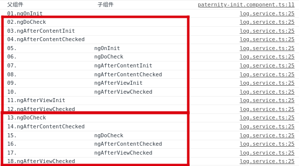
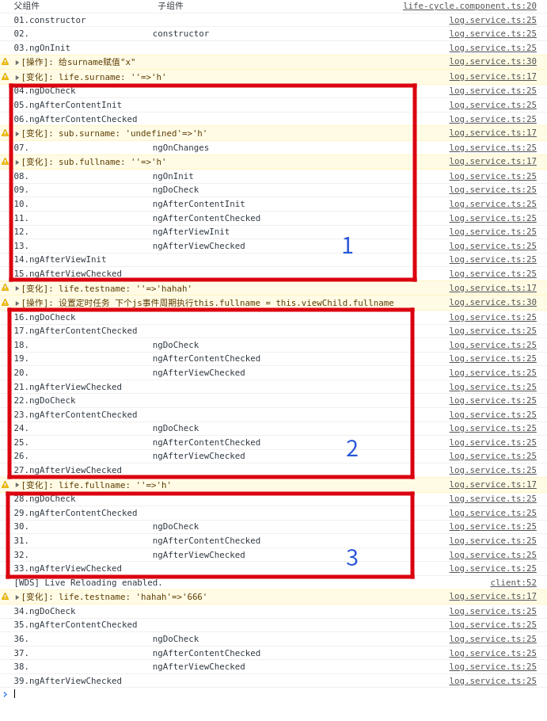
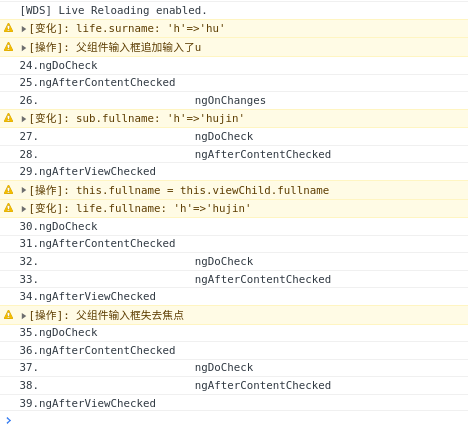
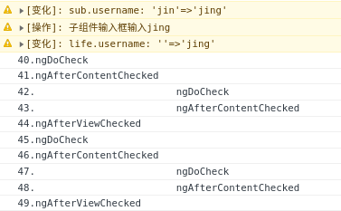

# 生命周期范例

详细代码见 [angular-explore](https://github.com/Lethe-HJ/angular-explore)

## 1 范例1 paternity-init

### 1.1关键代码

子组件

[son.component.html](/src/app/angular-component/life-cycle/paternity-init/son/son.component.html)
[son.component.ts](/src/app/angular-component/life-cycle/paternity-init/son/son.component.ts)

父组件

[paternity-init.component.html](/src/app/angular-component/life-cycle/paternity-init/paternity-init.component.html)
[paternity-init.component.ts](/src/app/angular-component/life-cycle/paternity-init/paternity-init.component.ts)

初次进入两轮检测
刷新后三轮检测



## 2 范例2 life-cycle

### 2.1关键代码

子组件

[sub.component.html](/src/app/angular-component/life-cycle/component/sub/sub.component.html)

[sub.component.ts](/src/app/angular-component/life-cycle/component/sub/sub.component.ts)

父组件

[life-cycle.component.html](/src/app/angular-component/life-cycle/life-cycle.component.html)

[life-cycle.component.ts](/src/app/angular-component/life-cycle/life-cycle.component.ts)

### 2.2触发的生命周期



| 序号 | 父组件                | 子组件                | 发生的变化                 | 备注                                                                                                          |
| :--- | :-------------------- | :-------------------- | :------------------------- | :------------------------------------------------------------------------------------------------------------ |
| 1    | constructor           |                       |                            | 构造函数                                                                                                      |
| 2    |                       | constructor           |                            |                                                                                                               |
| 3    | ngOnInit              |                       | life.surname: ''=>'h'      | 这里执行了this.surname = 'h';                                                                                 |
| 4    | ngDoCheck             |                       |                            | 第1轮变更检测 需包含 XXXInit                                                                                  |
| 5    | ngAfterContentInit    |                       |                            | 把外部内容投射进组件视图或指令所在的视图之后调用                                                              |
| 6    | ngAfterContentChecked |                       |                            | 检查完被投射到组件或指令中的内容之后调用。                                                                    |
| 7    |                       | ngOnChanges           | sub.fullname: ''=>'h'      | 设置或重新设置数据绑定的输入属性时响应                                                                        |
| 8    |                       | ngOnInit              | sub.username: ''=>'jin'    | 这里执行了this.surname = 'jin'                                                                                |
| 9    |                       | ngDoCheck             |                            |                                                                                                               |
| 10   |                       | ngAfterContentInit    |                            |                                                                                                               |
| 11   |                       | ngAfterContentChecked |                            |                                                                                                               |
| 12   |                       | ngAfterViewInit       |                            | 初始化完组件视图及其子视图或包含该指令的视图之后调用                                                          |
| 13   |                       | ngAfterViewChecked    |                            | 做完组件视图和子视图或包含该指令的视图的变更检测之后调用                                                      |
| 14   | ngAfterViewInit       |                       |                            |                                                                                                               |
| 15   | ngAfterViewChecked    |                       | life.testname: ''=>'hahah' | testname属性的变化不会增加额外的变更检测 因为其后本身就有两轮变更检测 这里设置了定时任务 在下个js事件周期执行 |
| 16   | ngDoCheck             |                       |                            | 第2轮变更检测                                                                                                 |
| 17   | ngAfterContentChecked |                       |                            |                                                                                                               |
| 18   |                       | ngDoCheck             |                            |                                                                                                               |
| 19   |                       | ngAfterContentChecked |                            |                                                                                                               |
| 20   |                       | ngAfterViewChecked    |                            |                                                                                                               |
| 21   | ngAfterViewChecked    |                       |                            |                                                                                                               |
| 22   | ngDoCheck             |                       |                            | 第3轮变更检测                                                                                                 |
| 23   | ngAfterContentChecked |                       |                            |                                                                                                               |
| 24   |                       | ngDoCheck             |                            |                                                                                                               |
| 25   |                       | ngAfterContentChecked |                            |                                                                                                               |
| 26   |                       | ngAfterViewChecked    |                            |                                                                                                               |
| 27   | ngAfterViewChecked    |                       |                            | 到这里初始化后的三轮变更检测都已经执行完毕 结束这轮js事件周期                                                 |
| 28   | ngDoCheck             |                       | life.fullname: ''=>'h'     | 这轮变更检测是因为 上面的定时任务执行了this.fullname = this.viewChild.fullname触发的                          |
| 29   | ngAfterContentChecked |                       |                            |                                                                                                               |
| 30   |                       | ngDoCheck             |                            |                                                                                                               |
| 31   |                       | ngAfterContentChecked |                            |                                                                                                               |
| 32   |                       | ngAfterViewChecked    |                            |                                                                                                               |
| 33   | ngAfterViewChecked    |                       |                            |                                                                                                               |

> 注意 任意导致视图发生变化的操作都会触发一轮新的变更检测，其中包括属性变化（即使该属性的变化不会影响视图）



操作1 父组件surname输入框增加u

| 序号 | 父组件                | 子组件                | 发生的变化                                  | 备注                                                     |
| :--- | :-------------------- | :-------------------- | :------------------------------------------ | :------------------------------------------------------- |
| 24   | ngDoCheck             |                       | life.surname: 'h'=>'hu'                     |                                                          |
| 25   | ngAfterContentChecked |                       |                                             |                                                          |
| 26   |                       | ngOnChanges           | sub.surname:'hu' sub.fullname: 'h'=>'hujin' | 这里执行了 this.fullname = this.surname + this.username; |
| 27   |                       | ngDoCheck             |                                             |                                                          |
| 28   |                       | ngAfterContentChecked |                                             |                                                          |
| 29   | ngAfterViewChecked    |                       | life.fullname: 'h'=>'hujin'                 | 这里执行了this.fullname = this.viewChild.fullname        |
| 30   | ngDoCheck             |                       |                                             |                                                          |
| 31   | ngAfterContentChecked |                       |                                             |                                                          |
| 32   |                       | ngDoCheck             |                                             |                                                          |
| 33   |                       | ngAfterContentChecked |                                             |                                                          |
| 34   | ngAfterViewChecked    |                       |                                             |                                                          |

操作2 父组件surname输入框失去焦点

| 序号 | 父组件                | 子组件                | 发生的变化 |
| :--- | :-------------------- | :-------------------- | :--------- |
| 35   | ngDoCheck             |                       |            |
| 36   | ngAfterContentChecked |                       |            |
| 37   |                       | ngDoCheck             |            |
| 38   |                       | ngAfterContentChecked |            |
| 39   | ngAfterViewChecked    |                       |            |



操作3 子组件username输入框增加g

| 序号 | 父组件                | 子组件                | 发生的变化                                            | 备注                            |
| :--- | :-------------------- | :-------------------- | :---------------------------------------------------- | :------------------------------ |
| 40   | ngDoCheck             |                       | sub.username: 'jin'=>'jing' life.username: ''=>'jing' | 这里抛出事件修改了life.username |
| 41   | ngAfterContentChecked |                       |                                                       |                                 |
| 42   |                       | ngDoCheck             |                                                       |                                 |
| 43   |                       | ngAfterContentChecked |                                                       |                                 |
| 44   | ngAfterViewChecked    |                       |                                                       |                                 |

操作4 子组件username输入框失去焦点

| 序号 | 父组件                | 子组件                | 发生的变化 |
| :--- | :-------------------- | :-------------------- | :--------- |
| 45   | ngDoCheck             |                       |            |
| 46   | ngAfterContentChecked |                       |            |
| 47   |                       | ngDoCheck             |            |
| 48   |                       | ngAfterContentChecked |            |
| 49   | ngAfterViewChecked    |                       |            |

### 2.3分析

变更检测的顺序

1. 都是父组件先ngDoCheck ngAfterContentChecked
2. 然后子组件再ngDoCheck ngAfterContentChecked
3. 最后父组件 ngAfterViewChecked

操作1234都基本类似其中的差异是
操作1:
  由于子组件的输入属性发生了变化故 在子组件的ngDoCheck之前有个ngOnChanges
操作2和4
  虽然只是失焦事件 angular也会进行一遍检查
操作3
  子组件由于是抛出了事件 然后父组件接收到该事件再去修改的username属性
  特别的是虽然是子组件中的username属性先修改 再触发事件去修改父组件中的username属性
  但是 父组件的ngDoCheck要比子组件的ngDoCheck更先检测到username属性的变更
  这样就保持了上述所说的变更检测的顺序

## 2 范例2 peek-a-boo

### 2.1 关键代码

#### 2.1.1 子组件

peek-a-boo.component.ts

```ts
// tslint:disable: no-conflicting-lifecycle
import {
  AfterContentChecked,
  AfterContentInit,
  AfterViewChecked,
  AfterViewInit,
  Directive,
  DoCheck,
  OnChanges,
  OnDestroy,
  OnInit,
  SimpleChanges
} from '@angular/core';
import { Component, Input } from '@angular/core';
import { LoggerService } from './logger.service';

let nextId = 1;

@Directive()
export class PeekABooDirective implements OnInit {
  constructor(private logger: LoggerService) { }

  // implement OnInit's `ngOnInit` method
  ngOnInit() { this.logIt(`OnInit`); }

  logIt(msg: string) {
    this.logger.log(`#${nextId++} ${msg}`);
  }
}

@Component({
  selector: 'peek-a-boo',
  template: '<p>Now you see my hero, {{name}}</p>',
  styles: ['p {background: LightYellow; padding: 8px}']
})
// Don't HAVE to mention the Lifecycle Hook interfaces
// unless we want typing and tool support.
export class PeekABooComponent extends PeekABooDirective implements
             OnChanges, OnInit, DoCheck,
             AfterContentInit, AfterContentChecked,
             AfterViewInit, AfterViewChecked,
             OnDestroy {
  @Input()  name: string;

  private verb = 'initialized';

  constructor(logger: LoggerService) {
    super(logger);

    const is = this.name ? 'is' : 'is not';
    this.logIt(`name ${is} known at construction`);
  }

  // only called for/if there is an @input variable set by parent.
  ngOnChanges(changes: SimpleChanges) {
    const changesMsgs: string[] = [];
    for (const propName in changes) {
      if (propName === 'name') {
        const name = changes.name.currentValue;
        changesMsgs.push(`name ${this.verb} to "${name}"`);
      } else {
        changesMsgs.push(propName + ' ' + this.verb);
      }
    }
    this.logIt(`OnChanges: ${changesMsgs.join('; ')}`);
    this.verb = 'changed'; // next time it will be a change
  }

  // Beware! Called frequently!
  // Called in every change detection cycle anywhere on the page
  ngDoCheck() { this.logIt(`DoCheck`); }

  ngAfterContentInit() { this.logIt(`AfterContentInit`);  }

  // Beware! Called frequently!
  // Called in every change detection cycle anywhere on the page
  ngAfterContentChecked() { this.logIt(`AfterContentChecked`); }

  ngAfterViewInit() { this.logIt(`AfterViewInit`); }

  // Beware! Called frequently!
  // Called in every change detection cycle anywhere on the page
  ngAfterViewChecked() { this.logIt(`AfterViewChecked`); }

  ngOnDestroy() { this.logIt(`OnDestroy`); }
}

```

#### 2.1.2 父组件

peek-a-boo-parent.component.ts

```ts
import { Component } from '@angular/core';

import { LoggerService } from './logger.service';

@Component({
  selector: 'peek-a-boo-parent',
  template: `
  <div class="parent">
    <h2>Peek-A-Boo</h2>

    <button (click)="toggleChild()">
      {{hasChild ? 'Destroy' : 'Create'}} PeekABooComponent
    </button>
    <button (click)="updateHero()" [hidden]="!hasChild">Update Hero</button>

    <peek-a-boo *ngIf="hasChild" [name]="heroName">
    </peek-a-boo>

    <h4>-- Lifecycle Hook Log --</h4>
    <div *ngFor="let msg of hookLog">{{msg}}</div>
  </div>
  `,
  styles: ['.parent {background: moccasin}'],
  providers:  [ LoggerService ]
})
export class PeekABooParentComponent {

  hasChild = false;
  hookLog: string[];

  heroName = 'Windstorm';
  private logger: LoggerService;

  constructor(logger: LoggerService) {
    this.logger = logger;
    this.hookLog = logger.logs;
  }

  toggleChild() {
    this.hasChild = !this.hasChild;
    if (this.hasChild) {
      this.heroName = 'Windstorm';
      this.logger.clear(); // clear log on create
    }
    this.hookLog = this.logger.logs;
    this.logger.tick();
  }

  updateHero() {
    this.heroName += '!';
    this.logger.tick();
  }
}

```

### 2.3 结果与分析


这个案例 父组件向子组件传递了一个`name`输入属性,
上图1-8展示了父组件给`heroName`（该属性绑定了子组件的name输入属性）
赋值后开始加载子组件时生命周期钩子的调用过程(受ngIf控制 heroName为布尔真才加载子组件)
上图9-15展示了父组件更新`heroName`属性时，子组件生命周期钩子的调用过程